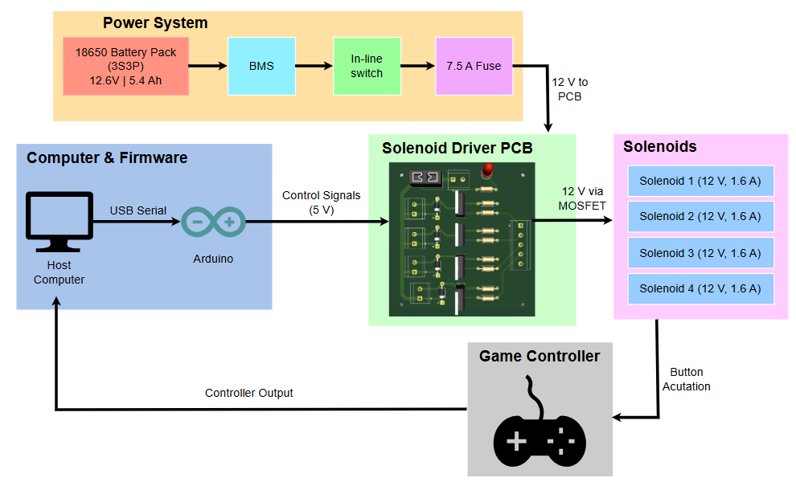

# Hardware

Hardware design, firmware, schematics, experiments, and documentation for the RL gaming robot.

## Directories

* [`electronics/`](electronics/) — Electrical system documentation, PCB design, power budget, and wiring diagrams.
* [`mechanical/`](mechanical/) — Mechanical design documentation and CAD files.
* [`firmware/`](firmware/) — Arduino firmware for the hardware control system.
* [`experiments/`](experiments/) — Hardware and controller experiments used during development.
* [`photos/`](photos/) — Miscellaneous ardware photos.

## System Overview

For detailed electrical architecture and subsystem documentation, see [`electronics/`](electronics/).
